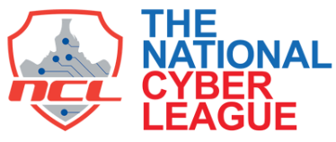

# CTF: Password Cracking and NCL Reverse Engineering

  

## Password Cracking
We use hashcat to solve the given passcodes, in normal circumstance we would prefer to use John the Ripper. The John files and the Ubuntu version did not agree with each other forcing us to use hashcat in place of John.

### Challenge:
Our analysts have obtained password dumps storing hacker passwords. After obtaining a few plaintext passwords, it appears that they overlap with the passwords from the *rockyou* breach.

[Hashcat](https://hashcat.net/hashcat/)

## Reverse Engineering

Reverse Engineering is the reproduction of a product after thorough examination of it's components.

### Challenge:
We need to break into a program that the hackers have created. You will need to provide the identifier, *6470*, as the only argument to the program.
What is the flag?

[Ghidra](https://ghidra-sre.org/)
